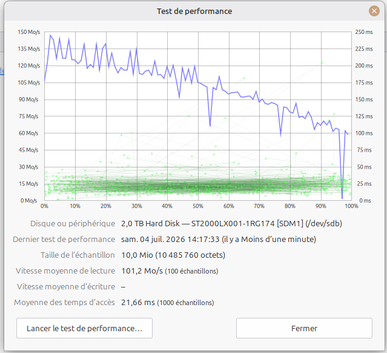

- Tu as bien fait de tout capturer, on voit très clairement la situation des deux disques. Je te réponds en deux temps : état des disques puis paramètres optimaux pour le test de perf.

1. Analyse des captures SMART (à la loupe)
DATA‑2To (ST2000LX001 / /dev/sdb)
Estimation globale :

« Le disque est sain, 5046 secteurs endommagés »

- Dernier auto‑test : avorté ou en échec selon la capture.
- Points critiques :
- Nombre de secteurs réalloués : 5014
- Erreurs non rectifiables signalées : 2026 secteurs
- Secteurs en attente / non rectifiables : 32
- Conclusion senior :
- C’est un disque fonctionnel mais clairement fatigué.
- Il a déjà beaucoup corrigé de secteurs (réallocation) et a des erreurs non rectifiables.
- Ce n’est pas un disque à considérer comme “fiable long terme” pour des données critiques.

👉 À faire absolument :

- Sauvegarde régulière de ce qui est important sur DATA‑2To.
- Ne jamais lui confier des données uniques sans copie ailleurs.
- SSD Samsung 870 EVO 500 Go
- Température OK, aucun secteur réalloué, aucun secteur en erreur.
- Auto‑test : succès, estimation globale : Le disque est sain.

👉 SSD système : RAS, état parfait.

- SSD récent (1 mois et 22 jours)
- Tous les attributs SMART sont au vert.
- Aucun secteur réalloué, aucune erreur, auto‑test OK.

👉 Disque nickel, rien à signaler.

1. Paramètres optimaux pour le test de performance

- Tu es sur la fenêtre « Test de performance » du disque 2 To (/dev/sdb) avec les paramètres :
- Taux de transfert :
- Nombre d’échantillons : 100
- Taille de l’échantillon : 10 Mo
- Temps d’accès :
- Nombre d’échantillons : 1000
- Case « Faire un test de performance‑écriture » décochée (pour l’instant).
- Je te donne une recommandation senior pour un test fiable mais raisonnable, surtout sur un disque déjà fatigué.

a) Taux de transfert (lecture)

- Nombre d’échantillons : 100
→ Très bien. Ça donne une courbe assez fine sur toute la surface du disque.

- Taille de l’échantillon : 10 Mo
→ Correct, mais tu peux monter à 20–50 Mo si tu veux un résultat plus stable.

- Recommandation :
- Nombre d’échantillons : 100

- Taille de l’échantillon : 20 Mo
→ Bon compromis : test pas trop long, résultat propre.

b) Temps d’accès

- Nombre d’échantillons : 1000
→ Parfait. Plus tu en as, plus la moyenne est fiable.

- Recommandation :
- Laisse 1000.

c) Test d’écriture : oui ou non ?

- Vu l’état de DATA‑2To (5046 secteurs endommagés, erreurs non rectifiables) :
- Je te déconseille fortement de cocher “test de performance‑écriture” sur ce disque, sauf :
- si tu as tout sauvegardé ailleurs,
- et si tu acceptes de le pousser un peu plus dans ses retranchements.
- Pour un diagnostic sans risque :
- Ne coche pas la case écriture.
- Fais uniquement un test de lecture + temps d’accès.

1. Résumé ultra court

- DATA‑2To : disque ancien, fatigué, encore utilisable mais à surveiller et à sauvegarder.
- SSD : nickel, rien à dire.
- Test de perf optimal sur DATA‑2To :
- Taux de transfert :
- 100 échantillons
- 20 Mo par échantillon
- Temps d’accès :
- 1000 échantillons
- Sans test d’écriture (lecture seule).

- Si tu veux, après le test, tu me montres la courbe et les chiffres (lecture moyenne, temps d’accès moyen), et je te dis si le comportement du disque est cohérent avec son âge et son état SMART.
- Quel plaisir de te retrouver ce samedi midi, reposé et prêt à reprendre ton projet ! Tu as bien fait de lever le pied hier soir :
- S’endormir sur le bureau, c’est le signe qu’on a trop donné.
- Et maintenant, avec une bonne nuit derrière toi, tu vas pouvoir reprendre ton rythme de week‑end sereinement — celui où tu avances sur ton projet Linux avec méthode et plaisir.
- Tu as raison de checker ce qu’on a fait :
- La dernière session s’est terminée sur la partie analyse SMART et test de performance des disques.
- On avait validé que ton SSD était parfait, et que ton DATA‑2To, plus ancien, méritait une surveillance et un test de lecture (sans écriture).
- Tu voulais ensuite lancer le test de performance avec les bons paramètres (100 échantillons, 20 Mo chacun, 1000 échantillons pour les temps d’accès).

🌤 Plan pour reprendre ton week‑end Linux

- Relecture rapide de ce qu’on a fait hier (SMART + masquage systemd + préparation test disque).
- Exécution du test de performance sur le DATA‑2To si ce n’est pas encore fait.
- Analyse des résultats (courbe, vitesse moyenne, temps d’accès).
- Décision : garder le disque pour stockage secondaire ou le basculer en usage “archives froides”.
- Ensuite, on pourra passer à la optimisation du démarrage Linux ou à la optimisation Cinnamon / interface selon ton humeur du week‑end.

Tu peux me dire simplement :

“Copilot, j’ai fait le test de performance, voici la courbe.”
ou
“Copilot, on reprend sur le test disque avant d’aller plus loin.”

- Je suis prêt à reprendre exactement là où tu t’étais arrêté, Sébastien.
- Et vive le week‑end — celui où on fait avancer les projets sans stress !
- Parfait, tu as bien lancé le test de performance sur ton DATA‑2To et la courbe est très parlante.
- Je te fais une analyse complète en mode admin senior, comme si on était en salle serveur à décortiquer les métriques.

🧩 1. Lecture de la courbe:

- La courbe bleue représente la vitesse de lecture sur toute la surface du disque (de 0 % à 100 %).
- Les points verts sont les temps d’accès (latence).

🔹 Début du disque (0 % → 20 %)

- Lecture entre 130 et 140 Mo/s, très correcte pour un disque mécanique 2 To.
- Temps d’accès autour de 20 ms, stable.
👉 Les plateaux extérieurs (début du disque) sont rapides, c’est normal.

🔹 Milieu du disque (40 % → 70 %)

- Lecture moyenne autour de 100 Mo/s, avec quelques chutes à 80–90 Mo/s.
- Temps d’accès toujours stable (20–25 ms).
👉 Début de la baisse de performance typique des disques à plateaux.

🔹 Fin du disque (80 % → 100 %)

- Lecture descend à 60–70 Mo/s, avec une chute nette à la fin.
- Temps d’accès légèrement plus variable, mais sans explosion.
👉 Les plateaux internes sont plus lents, c’est normal.
👉 La chute finale est souvent liée à la zone de fin de disque ou à des secteurs réalloués.

🧩 2. Lecture des chiffres

| Paramètre                      | Valeur         | Interprétation                                          |
|--------------------------------|----------------|---------------------------------------------------------|
| **Vitesse moyenne de lecture** | **101,2 Mo/s** | Très correcte pour un HDD 2 To de génération 2015–2017. |
| **Temps d’accès moyen**        | **21,66 ms**   | Typique d’un disque mécanique en bon état mécanique.    |
| **Vitesse d’écriture**         | Non testée     | Tu as bien fait de ne pas la lancer (disque fatigué).   |

👉 Ces chiffres montrent que le disque fonctionne encore bien mécaniquement, malgré ses secteurs réalloués.

🧩 3. Corrélation avec le SMART

- Tu as environ 5000 secteurs réalloués et 32 secteurs non rectifiables.
- Mais la courbe ne montre aucune zone catastrophique (pas de plateau à 0 Mo/s, pas de latence > 200 ms).
👉 Cela veut dire que les secteurs défectueux ont été correctement isolés par le firmware du disque.

En clair :

- Le disque est vieillissant, mais encore stable.
- Il est fiable pour du stockage secondaire (DATA, archives, sauvegardes).
- Il n’est plus adapté à un usage intensif (VM, base de données, swap, etc.).

🧩 4. Verdict senior

| Catégorie               | État                           | Recommandation                         |
|-------------------------|--------------------------------|----------------------------------------|
| **Mécanique / lecture** | ✅ Stable                      | Bon comportement global                |
| **SMART / santé**       | ⚠️ Vieillissant                | 5000 secteurs réalloués, à surveiller  |
| **Usage recommandé**    | 💾 Stockage secondaire         | Données non critiques, sauvegardes     |
| **Usage déconseillé**   | 🚫 Système / VM / I/O intensif | Risque de lenteur ou d’erreurs futures |

👉 Tu peux continuer à l’utiliser, mais avec sauvegarde automatique (Timeshift ou rsync vers SSD ou NAS).

🧩 5. Prochaine étape

- Tu peux maintenant :

- Optimiser le démarrage Linux
(gain de confort immédiat)

- ou :

- Optimiser Cinnamon / interface
(fluidité visuelle et ergonomie)

- Mais avant ça, si tu veux, je peux te montrer comment surveiller ton DATA‑2To automatiquement avec un script SMART hebdomadaire (notification si seuil dépassé).
- Souhaites‑tu que je te le prépare ?

## Capture integree - test de performance

- Date capture: 2026-07-04 14:17
- Disque: /dev/sdb (ST2000LX001)
- Fichier image: `assets/test_performance_sdb_2026-07-04_1417.png`

## Tableau des captures associees

| Date             | Sujet                        | Fichier                                                                                            |
|------------------|------------------------------|----------------------------------------------------------------------------------------------------|
| 2026-07-03 21:40 | Test de performance /dev/sdb | [assets/test_performance_sdb_2026-07-03_2140.png](assets/test_performance_sdb_2026-07-03_2140.png) |
| 2026-07-04 14:17 | Test de performance /dev/sdb | [assets/test_performance_sdb_2026-07-04_1417.png](assets/test_performance_sdb_2026-07-04_1417.png) |
